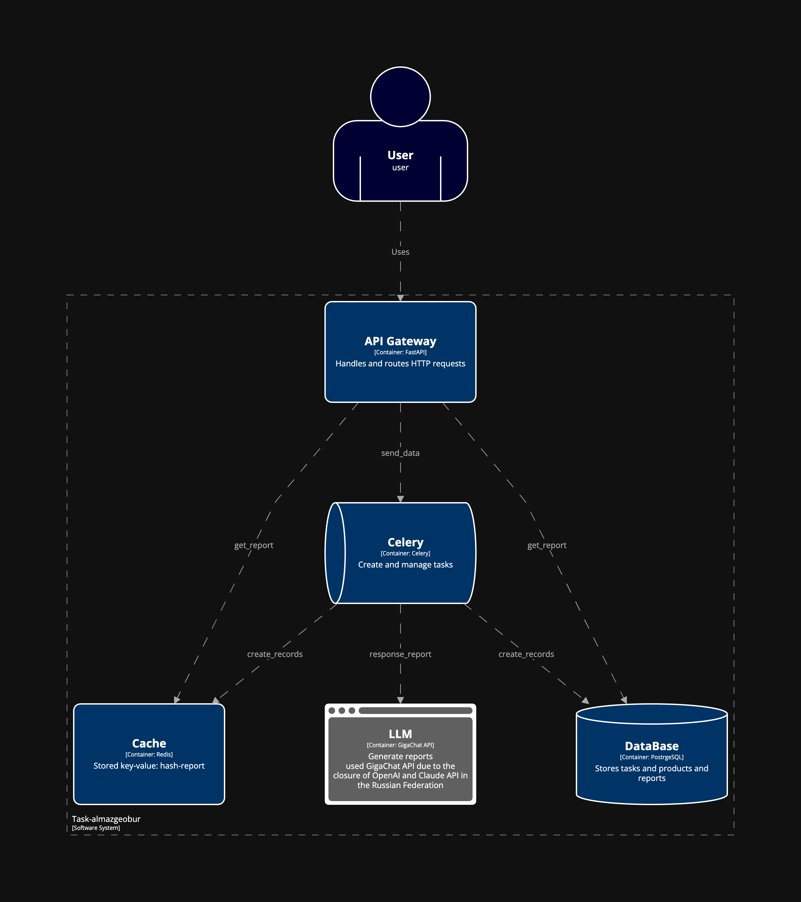

# task-Almazgeobur

## Установка

1. Клонируйте репозиторий командой:
	```
	git clone https://github.com/neojelll/task-Almazgeobur
	```

2. Получите Sber GigaChat Authorization token, как получить токен:
	[Get Authorization token docs](https://developers.sber.ru/docs/ru/gigachat/quickstart/ind-using-api)


3. Создайте в директории `app` файл .env по примеру в .env.example заменив на свои значения.
	- На MacOS:
		```
		cd app
		touch .env
		```
	- На Windows:
		```
		cd app
		echo. > .env
		```
	- На Linux также как и на MacOS.

4. Запустите `docker-compose` командой:
	```
	docker-compose up -d
	```

## Use Cases

### UC-1: Сгенерировать отчет по xml файлу

- Цель: Сгенерировать отчет.
- Предусловия: Нет.
- Описание: Пользователь отправляет POST-запрос на '/upload' с xml файлом.
- Пример запроса:
	```
	curl -X 'POST' \
  	'http://localhost:8000/upload' \
  	-H 'accept: application/json' \
  	-H 'Content-Type: multipart/form-data' \
  	-F 'file=@<sales-example.xml>;type=text/xml'
	```
- Результат: Пользователь получает хеш файла.

### UC-2: Получить отчет по хешу файла

- Цель: Получить отчет.
- Предусловия: Был выполнен POST-запрос на генерацию отчета.
- Описание: Пользователь отправляет GET-запрос на '/report' с хеш значением файла.
- Пример запроса:
	```
	curl -X 'GET' \
  	'http://localhost:8000/report?hash_file=<you_hash_file>' \
  	-H 'accept: application/json'
	```
- Результат: Пользователь получает отчет.

## Architecture Diagram

### Containers



## API документация
	
[API Documentation](http://localhost:8000/docs#/)

## Пример сгенерированного отчета

[xml файл](sales-example.xml)

[Oтчет по xml файлу](report-example.md)
